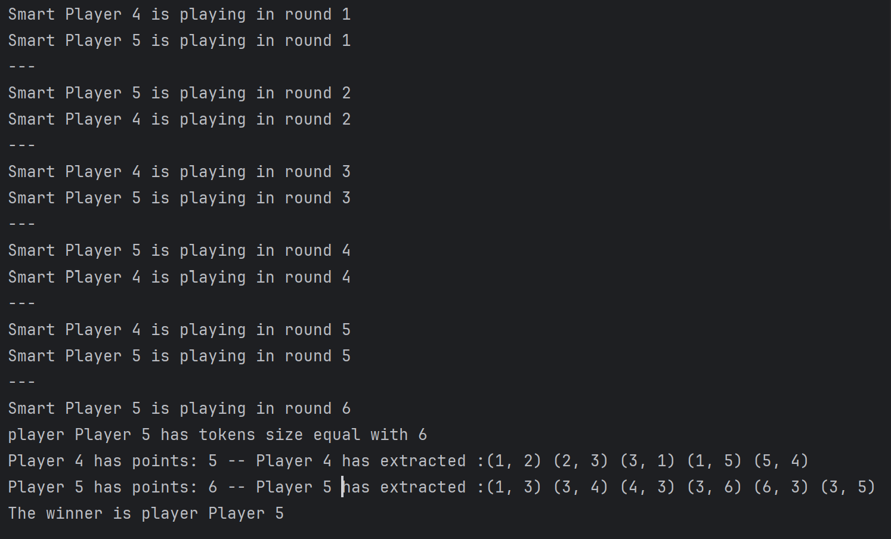

```
Write a program that simulates the following game between a given number of players.
At the beginning of the game there is a bag containing a number of tokens, each token being a distinct pair of numbers between 1 and n.
Each player extracts tokens successively from the bag and must create with them closed sequences of the form t1=(i1,i2), t2=(i2,i3),...,tk=(ik,i1), where ti are tokens and i1,i2,i3,...,ik are distinct numbers.
The value of a sequence is given by the number of its tokens.
The game ends when all tokens have been removed from the bag or when a player makes a sequence of length n. Each player receives a number of points equal to the value of its largest sequence.
The players might take turns (or not...) and a time limit might be imposed (or not...).

Implement the logic of the game and determine who the winner is at the end of the game.
The players will try to make their sequences using a simple heuristic.
Make sure that players wait their turns, using a wait-notify approach.
Implement a timekeeper thread that runs concurrently with the player threads, as a daemon. This thread will display the running time of the game and it will stop the game if it exceeds a certain time limit.

Implement a "smart" player. This should try to create the optimum sequence using its tiles, in some special cases.
Verify if the graph satisfies the Ore's condition and implement, a polynomial time algorithm for determining a hamiltonian cycle in graphs that meet Ore's condition.

```
!Lab7/images/round.png

<html>
  <div>
  
  </div>
</html>
